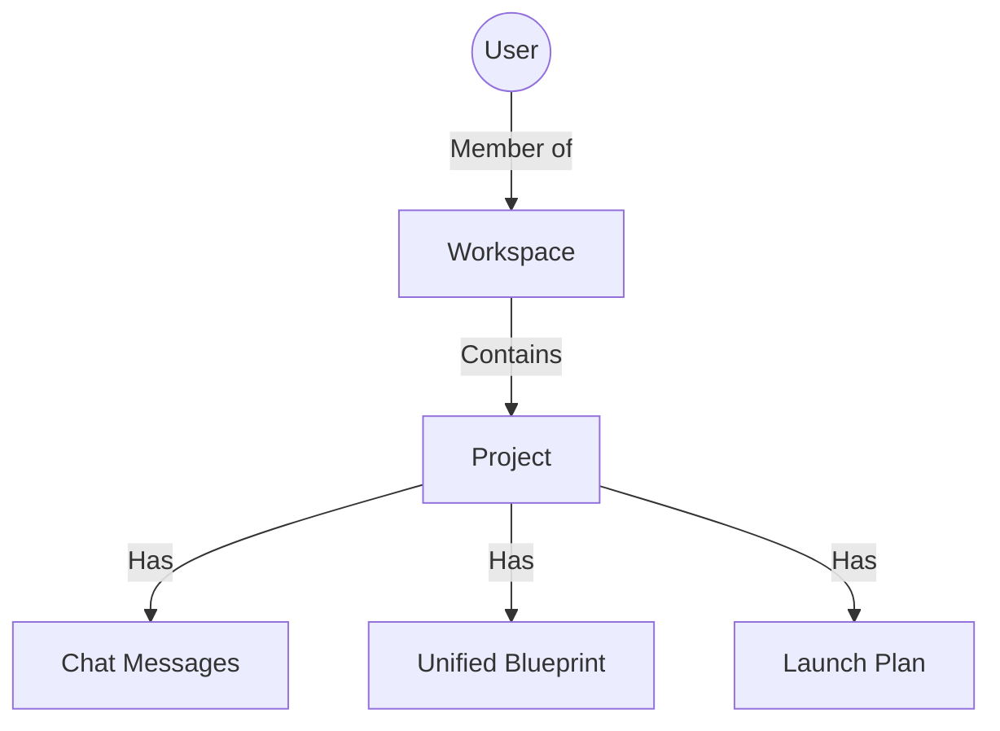

# Flowro System Architecture v2: Scalable & Team-Centric

**Objective**: Transition Flowro from a single-user prototyping model to a scalable, production-ready architecture following the `Teams -> Workspaces -> Projects` hierarchy. This design prioritizes **Scalability** (Firestore best practices) and **Simplicity** (clean data flow and permissions).

---

## 1. The "Golden Path" Hierarchy (Simplified)

To achieve the goal of **"Better and Not Complex"**, we will adopt a flat, 2-level hierarchy. This avoids the confusion of managing both "Teams" and "Workspaces" simultaneously.

**The Hierarchy:** `Workspace -> Project`.



### Why this flow?
-   **Workspace** (Top Level): The Organization or Company (e.g., "Acme Corp"). This is the billing and user management boundary.
-   **Project** (The Unit of Work): All work happens here. (e.g., "Website Redesign", "Mobile App").

> **Note**: We are intentionally **omitting** a "Team" layer (e.g., Marketing vs Engineering) for now. This keeps specific permissions simple. Projects can be filtered by tags if needed, but architectural nesting is minimized.

---

## 2. Core Data Model (Firestore Optimized)

### 2.1 `workspaces` (Root Collection)
The container for everything.
```typescript
interface Workspace {
  id: string;
  name: string; // e.g., "Acme Corp"
  ownerId: string;
  createdAt: string;
  // Billing and Global Settings
}
```

### 2.2 `projects` (Root Collection)
Linked to Workspace via ID.
```typescript
interface Project {
  id: string;
  workspaceId: string; // Foreign Key to Workspace
  name: string;
  description: string;
  // Clean: No embedded arrays for sub-resources
}
```

### 2.3 `users` & `memberships`
**`memberships` (Root Collection)**
```typescript
interface WorkspaceMembership {
  id: string; // workspaceId_userId
  workspaceId: string;
  userId: string;
  role: 'admin' | 'member' | 'viewer';
}
```

---

## 3. Scalability: Solving The "ChatMessage" Problem

### The Bottleneck
Currently, `chatHistory` is stored as an array array of objects inside the `Project` document.
> **Critical Issue**: Firestore documents have a **1MB hard limit**. A robust project chat with AI responses will hit this limit quickly, causing the app to crash (or data loss).

### The Solution: Subcollections
Move chat history to its own subcollection.

**Path**: `projects/{projectId}/messages/{messageId}`

```typescript
interface ChatMessage {
  id: string;
  projectId: string; // Redundant but useful
  senderId: string; // 'system' | 'ai' | userId
  content: string;
  timestamp: string;
  // Attachments, etc.
}
```

**Benefits**:
1.  **Infinite Retention**: You can have 1 million messages per project.
2.  **Performance**: You only load the last 20 messages (`limit(20)`) when opening a project, making load times instant regardless of history size.
3.  **Real-time Cost**: Listening to a document with a generic "chat" array charges you for the *entire* document read every time one message is added. Listening to a subcollection query only charges for the *new* document read.

---

## 4. Keeping it "Not Complex" (Simplicity)

Architecture is only as complex as its permissions and navigation.

### 4.1 Simple Permission Inheritance
**Waterfall Permissions**:
1.  **Workspace Level**: If you are a member of the **Workspace**, you have access to **All Public Projects** in that workspace.
2.  **Private Projects**: Restricted to specific members.

This keeps it "Not Complex". No "Team" invites, no "Channel" invites. Just:
*   "Invite to Acme Corp (Workspace)" -> Inherit access to all work.

### 4.2 Application State (URL Source of Truth)
Structure your Next.js App Router folders to match:
`/app/[workspaceId]/[projectId]/...`

- The layout fetches the `Workspace`.
- The page fetches the `Project`.
- The `teamId` variable is eliminated.

---

## 5. Migration Thinking (How to get there)

Since you already have data:

1.  **Step 1: The "Personal" Workspace**
    - For every existing `User`, create a `Workspace` (e.g., "Khalid's Workspace").
    - Migration Script: Iterate all existing `Projects`, set `workspaceId` = NewWorkspaceId.

2.  **Step 2: Service Layer Update**
    - Update `getUserProjects(userId)` to become `getWorkspaceProjects(workspaceId)`.
    - Modify the Frontend Router to support `/app/[workspaceId]`.

This approach allows you to upgrade the architecture without losing any data or breaking the user experience immediately.
