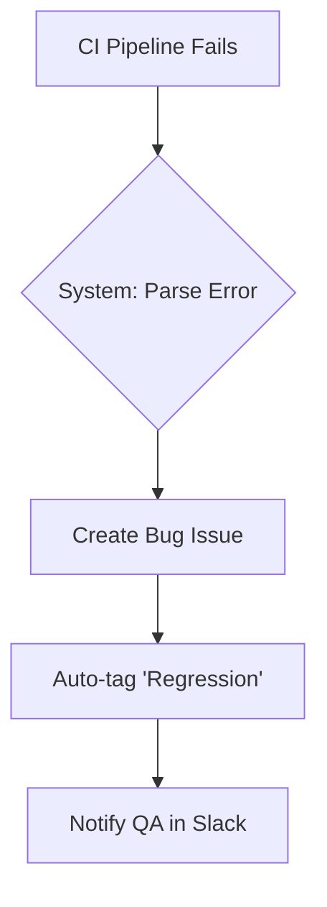
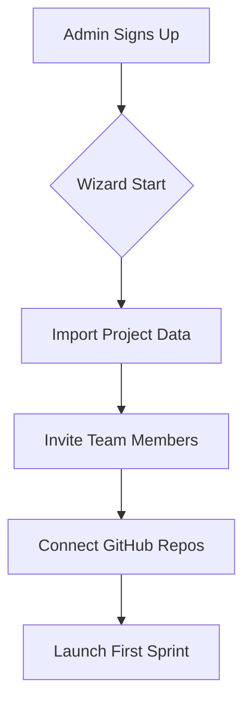
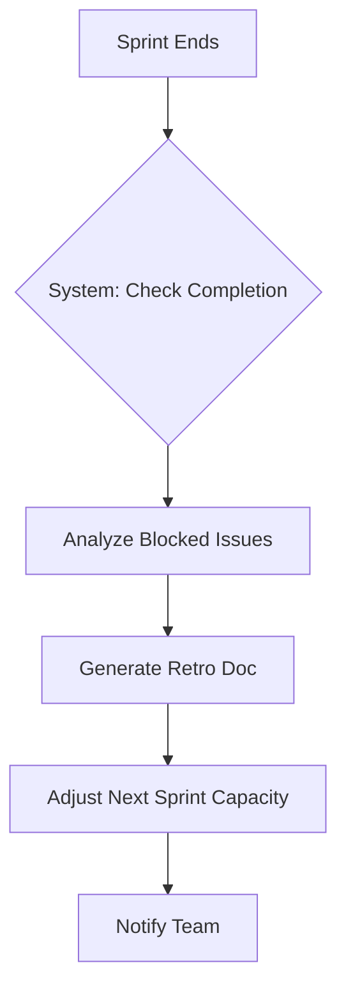
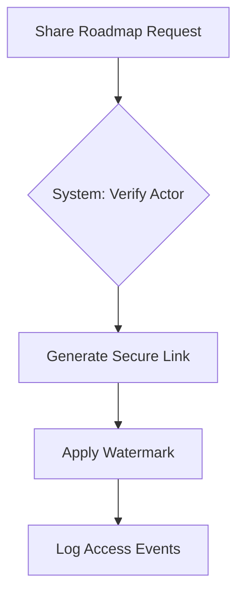
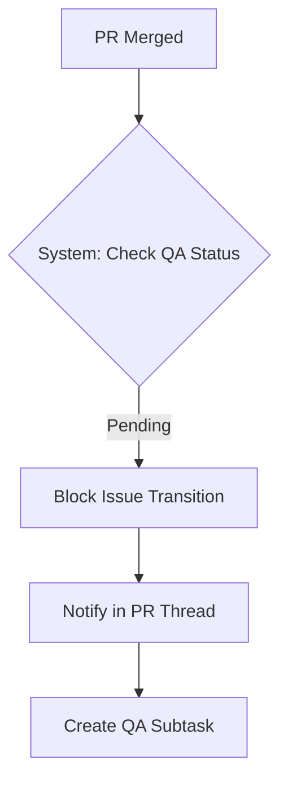
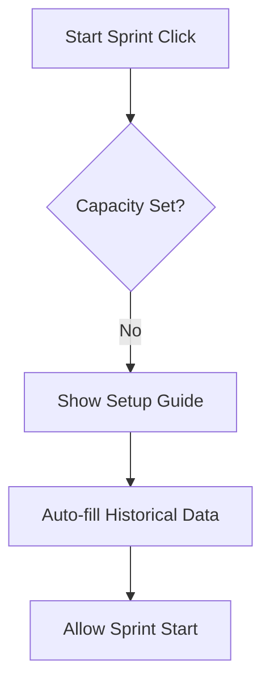

# FlowTrack

## Metadata
- **Version:** 0.1
- **Status:** draft
- **Created:** Jan 21, 2026, 11:37 AM
- **Exported:** Jan 21, 2026, 11:38 AM

---

## 1. Product Vision

Software teams waste 15-20 hours monthly switching between disjointed tools (Jira, GitHub, Slack), leading to misalignment, missed deadlines, and context loss.

### Primary Goal
Teams reduce daily standup time by 40% and release 25% faster due to unified context.

### Target Audience
Engineering managers and product leads at startups (10-50 person teams) who value speed but need structure.

## 2. Scope

### In Scope
- Issue tracking (epics, stories, bugs)
- Customizable Kanban/Scrum boards
- Sprint planning with capacity tracking
- Basic reporting (velocity, burndown)
- GitHub/GitLab sync (branches, PRs)
- Team roles & permissions (admin, member, viewer)
- Real-time notifications & @mentions

### Out of Scope
- Resource allocation across multiple projects
- Advanced portfolio roadmapping
- Built-in time tracking & invoicing
- Native mobile apps (mobile-web only initially)

## 3. Actors

### Engineering Manager
Primary user

### Developer
Support role

### QA Tester
Support role

### Product Manager
Support role

### Stakeholder (view-only)
Support role

### GitHub API
External system

### Slack API
External system

### CI/CD Systems (e.g., Jenkins)
External system

## 4. Behaviors

### B-01: Auto-populates issue with: stack trace, commit hash, environment details; assigns to 'Triage' column; notifies QA lead via Slack.

```gherkin
GIVEN User triggers: Developer creates a bug issue from a failed CI pipeline notification
WHEN Developer creates a bug issue from a failed CI pipeline notification
THEN Auto-populates issue with: stack trace, commit hash, environment details; assigns to 'Triage' column; notifies QA lead via Slack.
```



### B-02: Guided wizard: import existing Jira projects (CSV), invite members via email/Slack, set up default sprints (2-week cadence), configure GitHub repo connections.

```gherkin
GIVEN User triggers: First-time team admin onboarding
WHEN First-time team admin onboarding
THEN Guided wizard: import existing Jira projects (CSV), invite members via email/Slack, set up default sprints (2-week cadence), configure GitHub repo connections.
```



### B-03: Auto-create retrospective document with analytics; suggest capacity adjustment for next sprint; move incomplete items to backlog with 'carry-over' tag.

```gherkin
GIVEN User triggers: Sprint ends with 30% of issues incomplete
WHEN Sprint ends with 30% of issues incomplete
THEN Auto-create retrospective document with analytics; suggest capacity adjustment for next sprint; move incomplete items to backlog with 'carry-over' tag.
```



### B-04: Create shareable view (no edit rights); watermark with 'Confidential'; track who viewed/exported data; expire link in 30 days.

```gherkin
GIVEN User triggers: Stakeholder requests read-only access to roadmap
WHEN Stakeholder requests read-only access to roadmap
THEN Create shareable view (no edit rights); watermark with 'Confidential'; track who viewed/exported data; expire link in 30 days.
```



### B-05: Block issue transition to 'Done'; post comment in PR thread; notify QA lead; create follow-up subtask for verification.

```gherkin
GIVEN User triggers: GitHub PR merged but linked issue has pending QA steps
WHEN GitHub PR merged but linked issue has pending QA steps
THEN Block issue transition to 'Done'; post comment in PR thread; notify QA lead; create follow-up subtask for verification.
```



### B-06: Prevent sprint start; guide user through team capacity setup; suggest historical velocity; offer quick-template based on past sprints.

```gherkin
GIVEN User triggers: Team attempts to start sprint with zero capacity set
WHEN Team attempts to start sprint with zero capacity set
THEN Prevent sprint start; guide user through team capacity setup; suggest historical velocity; offer quick-template based on past sprints.
```



## 5. Constraints & Risks

### 📋 Constraint
**Type:** warning

Must support 500+ concurrent users per workspace

### 📋 Constraint
**Type:** warning

Real-time sync must work with 2s latency max

### 📋 Constraint
**Type:** warning

Data retention: 2 years minimum

### 📋 Constraint
**Type:** warning

Must comply with GDPR/CCPA

### ⚠️ Risk
**Type:** risk

Jira migration friction (data loss concerns)

### ⚠️ Risk
**Type:** risk

GitHub API rate limiting breaking sync

### ⚠️ Risk
**Type:** risk

Over-customization leading to support burden

### ⚠️ Risk
**Type:** risk

Free tier attracting non-serious users

## 6. Technology Decisions

| Category | Choice |
|----------|--------|
| Frontend | React 18 + TypeScript, Tailwind CSS, Realtime SDK (Socket.io) |
| Backend | Node.js (NestJS), GraphQL API, BullMQ for queues |
| Database | PostgreSQL (primary), Redis (caching/sessions), TimescaleDB for analytics |

## 7. Implementation Phases

### 🔄 Phase 1: Phase 1 (MVP)

Core issue tracking + GitHub sync

### ⏳ Phase 2: Phase 2 (Agile)

Full sprint management + reporting

### ⏳ Phase 3: Phase 3 (Scale)

Enterprise + ecosystem

## 8. Integration Points

| System | Method | Purpose |
|--------|--------|---------|
| GitHub/GitLab | `Bi-directional via webhooks (issues ⇄ PRs)` | Sync commits, PRs, branches to issues |
| Slack | `Outbound notifications, slash-command inbound` | Notifications, quick issue creation |
| CI/CD (Jenkins/CircleCI) | `Inbound webhooks with error payloads` | Auto-create bugs from failures |

## 9. Change Log

### v0.1: Initial draft based on Jira-like tool request
*Just now*

Generated from user input with best-practice assumptions